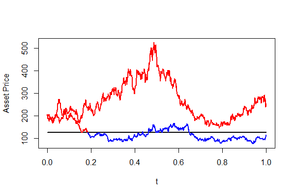
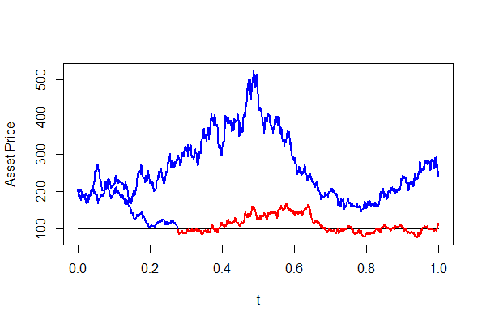
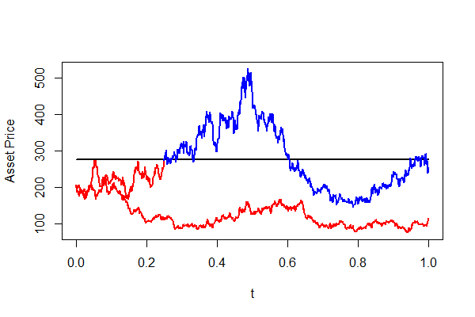
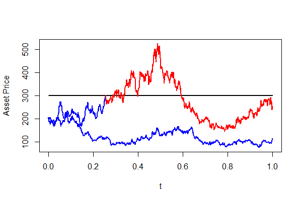

[](http://quantlet.de/)

## [](http://quantlet.de/) **SFEBarrier** [](http://quantlet.de/)

```yaml

Name of Quantlet : SFEBarrier

Published in : Statistics of Financial Markets I

Description : 'Compare and plots two possible paths of the asset price. Once the asset price hits
the barrier, the option expires worthless or becomes activated (depending upon the type of barrier
option), regardless of future stock price.'

Keywords : exotic-option, asset, stochastic-process, time-series, plot

See also : SFEdown-and-out

Author : Chinghsi Lee, Sai Niranjan Mohanamurali

Submitted : 2015/12/30

Input: 
- S0: Stock''''s Initial Price
- r: Interest Rate per year
- vol: Volatility per year
- b: Barrier
- c: 'Type of Barrier Option (1: Down and Out, 2: Up and Out, 3: Down and In, 4: Up and In)'
- 'User inputs the SFEBarrier parameters [Stock's Initial Price, Interest Rate, Volatility,
Barrier, Type of Barrier option] like [200, 0.05, 0.03, 100, 1]'

Output : Plot of a Barrier Option, depending on the type chosen

Example: 
- 1: 'Down and Out Option: [200, 0.05, 0.03, 100, 1]'
- 2: 'Up and Out Option: [200, 0.05, 0.03, 300, 2]'
- 3: 'Down and In Option: [200, 0.05, 0.03, 125, 3]'
- 4: 'Up and In Option: [200, 0.05, 0.03, 275, 4]'

```










### R Code:
```r

# clear variables and close windows
rm(list = ls(all = TRUE))
graphics.off()

# para = c(200, 0.05, 0.03, 100, 1)

# set pseudo random numbers
set.seed(3)

print("Please input Stock's Initial Price S0, Interest Rate per Year r,")
print("Volatility per year vol , Value of the barrier b and Type of Barrier c")
print("Choose c = 1: Down and Out, 2: Up and Out, 3: Down and In, 4: Up and In")
print("Notice that Down and Out option: S0 > b, Up and Out option: S0 < b")
print("Down and In option: S0 > b, Up and In option: S0 < b")
print("For instance for Down and Out option = 200 0.05 0.03 100 1")
print("Then press enter 2 times")
para = scan()

while (length(para) < 5 | length(para) > 5 | any(para <= 0) | ((para[5] == 1 && para[1] <= 
  para[4]) | (para[5] == 2 && para[1] >= para[4]) | (para[5] == 3 && para[1] <= 
  para[4]) | (para[5] == 4 && para[1] >= para[4]))) {
  print("Not enough input arguments. Please input in 1*5 vector form like 200 0.05 0.03 100 1")
  print("[Stock's initial price S0, Interest Rate per Year r, volatility per Year vol, value of Barrier b, Type of Barrier c=")
  print("Please give correct entries and valid values for Barrier Option")
  para = scan()
}

S0  = para[1]  #Initial Stock Price
r   = para[2]  #Interest Rate per Year
vol = para[3]  #Volatility per Year
b   = para[4]  #Barrier value
c   = para[5]  #Type of Barrier

N = 1000
t = (1:N)/N
volatility = vol * vol
dt = 1
randomWt1 = rnorm(N, 0, 1)
randomWt2 = rnorm(N, 0, 1)
Wtsum1 = cumsum(t(randomWt1))
Wtsum2 = cumsum(t(randomWt2))
Path1 = exp((r - 0.5 * volatility) * dt + vol * sqrt(dt) * Wtsum1)
Path2 = exp((r - 0.5 * volatility) * dt + vol * sqrt(dt) * Wtsum2)
StockPath1 = matrix(0, N, 1)
StockPath2 = matrix(0, N, 1)
StockPath1[1] = S0
StockPath2[1] = S0

#plot different type of Barrier Option base on selection
if (c == 1) {
  # down and out graph
  for (i in 2:N) {
    StockPath1[i] = S0 * Path1[i]
    StockPath2[i] = S0 * Path2[i]
  }
  
  plot(t, rep(b, length(t)), col = "black", lwd = 2, ylab = "Asset Price", type = "l", 
    ylim = c(min(c(StockPath1, StockPath2, b)), max(c(StockPath1, StockPath2, 
      b))))
  
  lines(t, StockPath1, col = "blue", lwd = 2)
  lines(t, StockPath2, col = "blue", lwd = 2)
  end = length(t)
  
  h = which(StockPath1 < b)[1]
  if (is.na(h) == F) {
    lines(t[h:end], StockPath1[h:end], col = "red", lwd = 2)
  }
  hh = which(StockPath2 < b)[1]
  if (is.na(hh) == F) {
    lines(t[hh:end], StockPath2[hh:end], col = "red", lwd = 2)
  }
} else if (c == 2) {
  # up and out graph
  for (i in 2:N) {
    StockPath1[i] = S0 * Path1[i]
    StockPath2[i] = S0 * Path2[i]
  }
  
  plot(t, rep(b, length(t)), col = "black", lwd = 2, ylab = "Asset Price", type = "l", 
    ylim = c(min(c(StockPath1, StockPath2, b)), max(c(StockPath1, StockPath2, 
      b))))
  
  lines(t, StockPath1, col = "blue", lwd = 2)
  lines(t, StockPath2, col = "blue", lwd = 2)
  end = length(t)
  
  h = which(StockPath1 > b)[1]
  if (is.na(h) == F) {
    lines(t[h:end], StockPath1[h:end], col = "red", lwd = 2)
  }
  hh = which(StockPath2 > b)[1]
  if (is.na(hh) == F) {
    lines(t[hh:end], StockPath2[hh:end], col = "red", lwd = 2)
  }
} else if (c == 3) {
  # down and in graph
  for (i in 2:N) {
    StockPath1[i] = S0 * Path1[i]
    StockPath2[i] = S0 * Path2[i]
  }
  
  plot(t, rep(b, length(t)), col = "black", lwd = 2, ylab = "Asset Price", type = "l", 
    ylim = c(min(c(StockPath1, StockPath2, b)), max(c(StockPath1, StockPath2, 
      b))))
  
  lines(t, StockPath1, col = "red", lwd = 2)
  lines(t, StockPath2, col = "red", lwd = 2)
  end = length(t)
  
  h = which(StockPath1 < b)[1]
  if (is.na(h) == F) {
    lines(t[h:end], StockPath1[h:end], col = "blue", lwd = 2)
  }
  hh = which(StockPath2 < b)[1]
  if (is.na(hh) == F) {
    lines(t[hh:end], StockPath2[hh:end], col = "blue", lwd = 2)
  }
} else {
  # up and in graph
  for (i in 2:N) {
    StockPath1[i] = S0 * Path1[i]
    StockPath2[i] = S0 * Path2[i]
  }
  
  plot(t, rep(b, length(t)), col = "black", lwd = 2, ylab = "Asset Price", type = "l", 
    ylim = c(min(c(StockPath1, StockPath2, b)), max(c(StockPath1, StockPath2, 
      b))))
  
  lines(t, StockPath1, col = "red", lwd = 2)
  lines(t, StockPath2, col = "red", lwd = 2)
  end = length(t)
  
  h = which(StockPath1 > b)[1]
  if (is.na(h) == F) {
    lines(t[h:end], StockPath1[h:end], col = "blue", lwd = 2)
  }
  hh = which(StockPath2 > b)[1]
  if (is.na(hh) == F) {
    lines(t[hh:end], StockPath2[hh:end], col = "blue", lwd = 2)
  }
}

```
