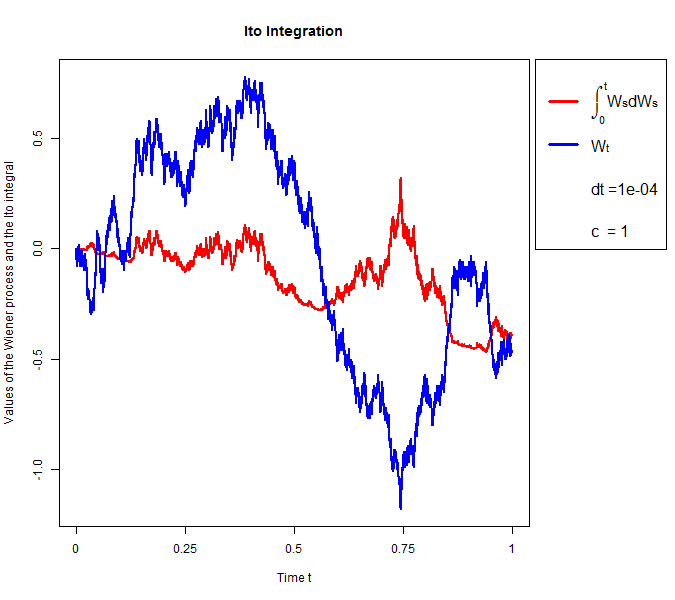

[](http://quantlet.de/index.php?p=info)

## [](http://quantlet.de/) **SFEItoIntegral** [](http://quantlet.de/d3/ia)

```yaml

Name of Quantlet : SFEItoIntegral

Published in : Statistics of Financial Markets I

Description : 'Generates and plots the path of a Wiener process and the corresponding Ito Integral
for a given specification of c and delta_t.'

Keywords : 'Black Scholes, Wiener process, Ito integration, stochastic integration, times series,
stochastic process'

See also : SFEWienerProcess, SFEItoProcess

Author : Michael Lebacher, Johannes Stoiber

Submitted : 2015/12/03

Input: 
- dt: delta t (dt= 0.0001 by default)
- c: constant (c=1 by default)
- set.seed: 'logical parameter (set.seed=TRUE by default, if set.seed=FALSE the random numbers do
change with repeated execution of the function)'

Output : A plot of the simulated process and a plot of the corresponding Ito Integral

```




```r

# clear variables and close windows

rm(list = ls(all = TRUE))
graphics.off()

# install and load packages
libraries = c("graphics")
lapply(libraries, function(x) if (!(x %in% installed.packages())) {
    install.packages(x)
})
lapply(libraries, library, quietly = TRUE, character.only = TRUE)


# define the function that generates the Wiener process and the corresponding Ito integral
SFEItoIntegral = function(dt       = 0.0001,  # delta t, determines the length of the step size
                          c        = 1,       # constant c, c = 1 by default
                          set.seed = TRUE     # determines the random numbers generation
                          ) {
  if (dt <= 0) {
    stop("Delta t must be strictly larger than 0!")
  }
  if (set.seed == TRUE) {
    set.seed(690)
  }
  
  # calculation of the basic parameters
  n   = floor(1/dt)                              
  t   = seq(0, 1, by = dt)                                   
  
  # calculation of the Wiener process
  w     = matrix(runif(n), n, 1)                 # defines a vector w which contains values randomly choosen greater or smaller than zero
  w     = 2 * (w > 0.5) - 1                      # rescales the vector w to -1 or 1
  dx    = c * sqrt(dt)                           # defines the scaling factor dx
  w 	= w * dx                                   
  w 	= apply(w, MARGIN = 2, FUN = cumsum)
  
  # calculation of the Ito Integral 
  int  = (w^2-t[-1])/2
  output 	 = cbind(int, w)
  
  # plotting to a file
  png("SFEItoIntegral.png", width = 675, height = 600) 
  par(mar=c(5.1, 4.1, 4.1, 10.1), xpd=TRUE)
  cols  = c("red","blue", "white", "white")
  leg   = expression(paste(integral(,0,t),"W",scriptstyle(s),"dW",scriptstyle(s),sep=""),paste("W",scriptstyle(t),sep=""))
  ax    = c(seq(0, 1, by = 0.25)) 
  matplot(output, lwd = 2, type = "l", cex=1.3, lty = 1, ylim = c(min(output), max(output)), col = cols, main = "Ito Integration", 
		  xlab = "Time t", ylab = "Values of the Wiener process and the Ito integral", xaxt="n")
  axis(side=1, at = seq(0,n, by = n/4), labels = ax)
  legend("topright", inset = c(-0.29,0), legend=c(leg, paste("dt =", dt, sep=""),paste("c  = ", c, sep="")),
		 col = cols,lty=1, ncol=1,cex=1.3,bty="o",lwd=3)
  
  dev.off()
}

# function call
SFEItoIntegral(dt=0.0001, c=1) 

```
