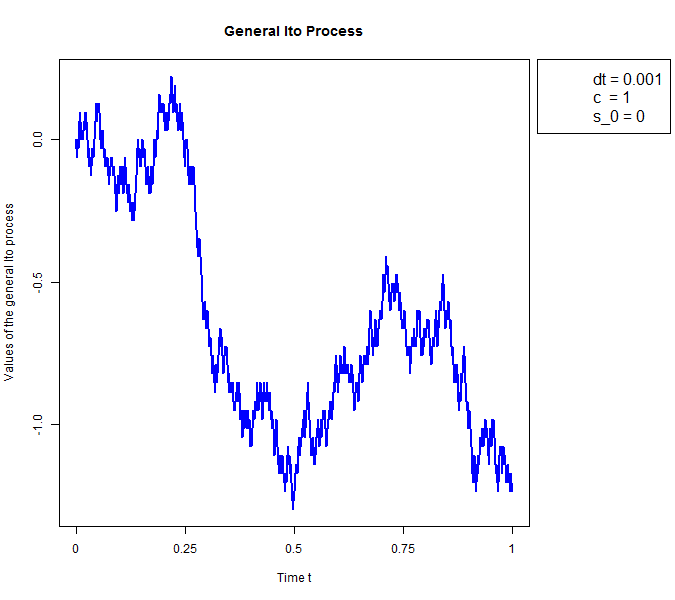

[](http://quantlet.de/index.php?p=info)

## [](http://quantlet.de/) **SFEItoProcess** [](http://quantlet.de/d3/ia)

```yaml

Name of Quantlet : SFEItoProcess

Published in : Statistics of Financial Markets I

Description : Generates and plots the path of a general Ito process.

Keywords : 'Black Scholes, Ito process, Wiener process, Cox-Ingersoll-Ross process, geometric
Brownian Motion, times series, stochastic process'

See also : SFEWienerProcess, SFEItoIntegral

Author : Michael Lebacher, Johannes Stoiber

Submitted : 2015/12/03

Input: 
- dt: delta t
- c: constant c
- start_val: starting value for the process

Output : A plot of the simulated Ito process.

```




```r

# clear variables and close windows

rm(list = ls(all = TRUE))
graphics.off()


# Paramters for the general Ito process
dt        = 0.0001                             # delta t, determines the length of the step size
c         = 1                                  # constant c
start_val = 1                                  # defines the starting value
set.seed(0)                                    # regulates that random numbers do not change with repeated executions of the code

mu = function(S,t) {
  mu  = 1*S+t                                  # define the functional form of mu
  return(mu)
}

sigma = function(S,t) {
  sigma  = S*t                                 # define the functional form of sigma
  return(sigma)
}
# calculation of related basic parameters
n    = floor(1/dt)                              
t    = seq(0, n, by = dt) 

# calculation of the Wiener process
w    = matrix(runif(n), n, 1)                   # defines a vector w which contains values randomly choosen greater or smaller than zero
w    = 2 * (w > 0.5) - 1                        # rescales the vector w to -1 or 1
dx   = c * sqrt(dt)                             # defines the scaling factor dx
dw   = w * dx                                   # gives the increments of a Wiener process
  
# calculation of the general Ito process
S    = matrix(0, n, 1)                          # defines an vector s of length n containing zeros
S[1] = start_val                                # defines the staring value
  
for (i in 2:dim(dw)[1]) {
   S[i]  = mu(S[i-1],t[i-1])*dt + sigma(S[i-1],t[i-1])*dw[i] + S[i-1]
}
  
# plotting to a file
png("SFEItoProcess.png", width = 675, height = 600) 
par(mar=c(5.1, 4.1, 4.1, 10.1), xpd=TRUE)
cols  = c("white", "white")
ax    = c(seq(0, 1, by = 0.25))
matplot(S, lwd = 2, type = "l", lty = 1, ylim = c(min(S), max(S)), col = "blue", main = "General Ito Process", 
		xlab = "Time t", ylab = "Values of the general Ito process", xaxt="n")
axis(side=1, at = seq(0,n, by = n/4), labels = ax)
legend("topright", inset = c(-0.3,0), legend=c(paste("dt = ", dt, sep=""),paste("c  = ", c, sep=""),
		paste("s_0 = ",start_val , sep="")), col = cols,lty=0, ncol=1,cex=1.3,bty="o",lwd=0)
dev.off()

```
