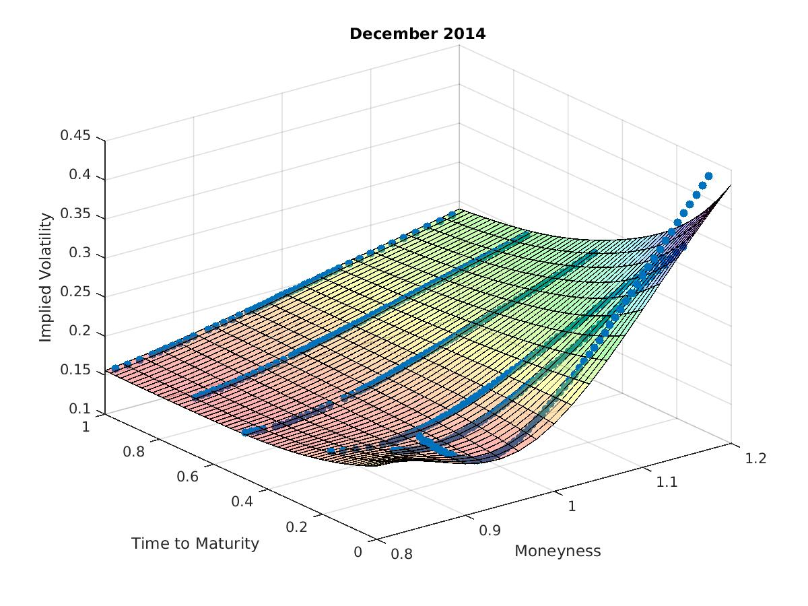

[](http://quantlet.de/index.php?p=info)

## [](http://quantlet.de/) **VolSurfPlot** [](http://quantlet.de/d3/ia)

```yaml

Name of QuantLet: VolSurfPlot

Description: 'Produces a graphic visualisation of the
implied volatility surface. The implied volatility
smiles are shown as blue scatter plot.'

Keywords: Black Scholes, implied volatility, volatility

See also: SFEVolaTermStructure, SFEVolaCov, SFEVolaPCA, SFEPCA, SFEVolSurfMovie

Author: Maria Grith

Author[Update]: Sabine Bertram, Steffen Thesdorf

Datafile: surf_1412.csv

Input: 'Price of the option, skrike price, risk-free interest rate,
time to maturity, price of the underlying and Put-Call-flag'

Output: Plot of implied volatility surface
```




```m

```
