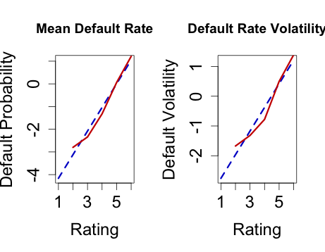

[](http://quantlet.de/index.php?p=info)

## [](http://quantlet.de/) **SFEdefault** [](http://quantlet.de/d3/ia)

```yaml

Name of Quantlet : SFEdefault

Published in : Statistics of Financial Markets

Description : 'Calculates the historical mean and volatility of default rate bonds belong to
different ratings and also the corresponding regression by exponential function fitting. Estimates
the asset correlation using one-factor model.'

Keywords : default rate, regression, volatility, asset correlation

See also : 'BaseCorrGaussModelCDO, CompCorrGaussModelCDO, ETL, SFEETLGaussTr1, SFEbaseCorr,
SFEcompCorr, SFEcompCorr, SFEdefaproba, SFEmyfun, lowerTrLossGauss'

Author : Ya Qian

Submitted : 2015/12/30

Datafile : SFEMoodydefault.csv

Output : 'Historical mean of default rate, default rate volatility, the corresponding regression by
exponential function fitting and the estimated one-factor model asset correlation.'

```




```r
#Close windows and clear variables                                                                   
graphics.off()
rm(list = ls(all=TRUE))  

# install and load packages
libraries = c("mnormt","stats")
lapply(libraries, function(x) if (!(x %in% installed.packages())) {
    install.packages(x)})
lapply(libraries, library, quietly = TRUE, character.only = TRUE)

#Read dataset                                                                                                       
D                  = read.csv("SFEMoodydefault.csv", header = TRUE, sep = ";", dec = ",")   
DD                 = D[ ,-1]

#Calculate historic mean default rate and volatility
means              = sapply(DD, mean)
sds                = sapply(DD, sd)

#Omit the Aaa-rate bond when fit by exponential function
C                  = c(1:6)
C1                 = c(2:6)

#Exponential fitting of the mean default rate
exponential.model  = lm(log(means[-1]) ~ C1)
A                  = coef(exponential.model)
y                  = C*A[2]+A[1]
est.means          = exp(y)

#Exponential fitting of the default rate volatility
exponential.model1 = lm(log(sds[-1]) ~ C1)
A1                 = coef(exponential.model1)
y1                 = C*A1[2]+A1[1]
est.sds            = exp(y1)

#combine ploting data in one file
z                  = cbind(C1,log(means[-1]))
z1                 = cbind(C1,log(sds[-1]))

#plot default probability and default volatility
par(mfrow = c(1,2))
plot(C, y, main = "Mean Default Rate", xlab = "Rating",  ylab = "Default Probability", 
    type = "l", col = "blue3", lwd = 3, cex.axis = 1.5, cex.lab = 1.5, lty = 2)
lines(z, col = "red3", lty = 1, lwd = 3)

plot(C, y1, main = "Default Rate Volatility", xlab = "Rating",  ylab = "Default Volatility", 
    type = "l", col = "blue3", lwd = 3, cex.axis = 1.5, cex.lab = 1.5, lty = 2)
lines(z1, col = "red3", lty = 1, lwd = 3)

#Estimate asset correlations of rating classes

f = function(rho, defpro, defvol){
    f = defvol^2-pmnorm(c(qnorm(defpro),qnorm(defpro)), mean = rep(0, 2), matrix(data = c(1,rho,rho,1),nrow = 2))+defpro^2
}

# Find asset correlations   
rho = c(0,0,0,0,0,0)
for (i in 1:6)
rho[i] = uniroot(f, interval = c(0,1), lower=0, upper=1, tol = .Machine$double.eps^0.25,
    defpro = est.means[i]/100, defvol = est.sds[i]/100)

#Rename variables and print the result table
Mean      = means
Stand.dev = sds
mu        = est.means
sigma     = est.sds
rho       = as.numeric(rho)
assetcorr = rho*100
output    = cbind(Mean,Stand.dev, mu, sigma,assetcorr)
MEAN      = c(mean(means),mean(sds),mean(est.means),mean(est.sds),mean(assetcorr))# Compute mean of each variable estimation
table     = rbind(output, MEAN)
print(table)


```
