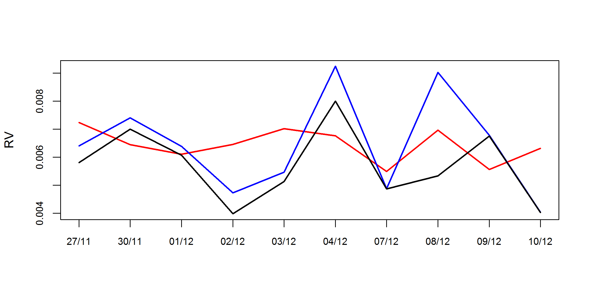

[](http://quantlet.de/)

## [](http://quantlet.de/) **SFErealizedVarianceIPC** [](http://quantlet.de/)

```yaml

Name of QuantLet : SFErealizedVarianceIPC

Published in : Statistics of Financial Markets I

Description : 'Realized variance analysis and graphical representation of 10 days high frequency
data from the Mexican stock market IPC and comparison with the foretold index harModel results'

Keywords : Volatility, graphical representation, time-series, log returns, variance

Author : Luis Alejandro Sarmiento Abogado

Submitted : Tue, December 28 2015 by Luis Alejandro Sarmiento Abogado

Datafile : IPC (5 MIN) 26_11-10_12.csv

```




### R Code:
```r
# Install Performance Analytics package version 1.4.3541 and highfrequency package version 0.4. Zoo and xts package needs to be installed
# Clear enviorenment
graphics.off()
rm(list = ls())

# Load packages
library(highfrequency)
library(PerformanceAnalytics)

# Realized variance ( the realized variance converges in probability to
# the integrated variance ad n goes to infinity)

# Download File
ipc = read.csv(file = "IPC (5 MIN) 26_11-10_12.csv", sep = ",", head = TRUE)

# Download data and transform it to a data frame
ipc = as.data.frame(ipc)

# Convert the date strings to charachter vectors in order to transform
# it to Date format.
ipc[, 1] = as.character(ipc[, 1])
ipc[, 2] = as.character(ipc[, 2])

# Separate the Price vector from the data frame .
price = ipc[, 5]
price = as.data.frame(price)

# Transform the time and date charachter vectors to a valid R format
time = as.POSIXct(paste(ipc$Date, ipc$Time), format = "%Y-%m-%d %H:%M")

# Set the price vector as an extensible time series object in order to
# apply function rCov
price = xts(price, order.by = time)

# Use the rCov function to compute the realized varianze
v = rCov(price, align.by = "minutes", align.period = 5, makeReturns = TRUE)

# Compute the logaritmic returns of our transformed price vector
pricer = makeReturns(price)

# Apply harModel function which returns the estemites of an
# heterogeneous autoregressive model For realized volatility.  The
# model is mainly used to forecast next day volatility based on the
# high frequency returns of the past (aggregated by one day).
rv = harModel(pricer, periods = c(1, 1, 1), periodsJ = c(1, 1, 1), 
              RVest = c("rCov","rBPCov"), type = "HARRVCJ", transform = "sqrt")

# Plot realized variance VS realized volatility 'rBPCov'), type =
# 'HARRVCJ', transform = 'sqrt')
# pdf(file = "RV1.pdf", width = 8, height = 4)
png(file = "RV1.png", width = 8, height = 4, units = "in", res = 300)
chart.TimeSeries(
  cbind(sqrt(v),rv$residuals+rv$fitted.values,rv$fitted.values)[-1,],
  type = "l", 
  main = NA, #"Observed and forecasted RV based on HAR Model: HARRV", 
  ylab = "RV",
  col = c("black","blue","red"), 
  auto.grid = F,
  date.format = "%d/%m",
  lwd = 2,
  element.color ="black",
  minor.ticks = FALSE
)
dev.off()


```
