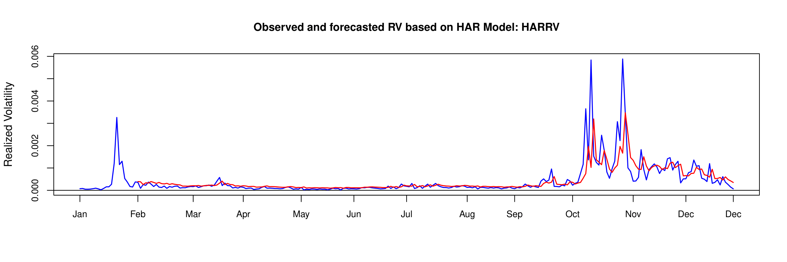
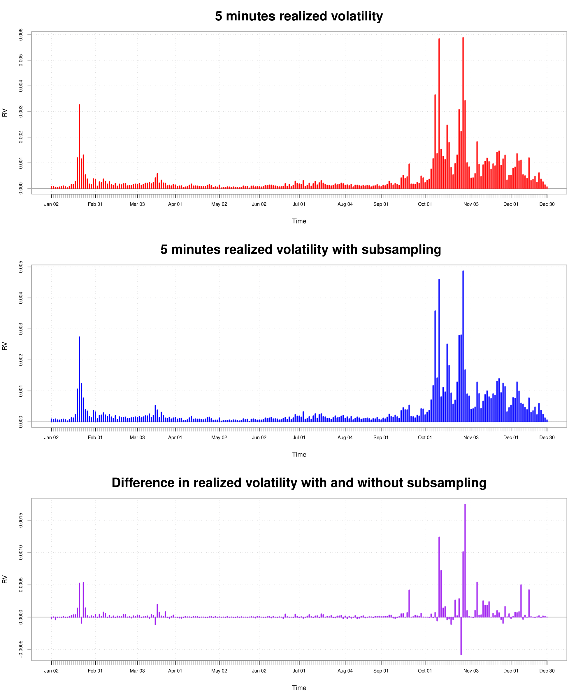

[](http://quantlet.de/)

## [](http://quantlet.de/) **SFErealizedVolatilityDAX** [](http://quantlet.de/)

```yaml

Name of QuantLet : SFErealizedVolatilityDAX

Published in : Statistics of Financial Markets I

Description : 'Realized variance analysis and graphical representation of 5 seconds intraday
highfrequency realized variance from the German stock market DAX and comparison with it's lagged
subsample'

Keywords : Volatility, graphical representation, time-series, log returns, variance

Author : Luis Alejandro Sarmiento Abogado

Submitted : Tue, December 28 2015 by Luis Alejandro Sarmiento Abogado

Datafile : Dax Data current.csv

```







### R Code:
```r
# Install Performance Analytics package version 1.4.3541 and highfrequency package version 0.4. Zoo and xts package needs to be installed
# ipc realized variance, observed and predicted volatility and price
# movements

# Clear enviorenment
graphics.off()
rm(list = ls())

# Load packages
library(highfrequency)
library(PerformanceAnalytics)

# Download file
ipc = read.csv(file = "IPC RV Data.csv", sep = ",", head = TRUE, na.strings = c("", 
                                                                                "NA"))

# Download data and transform it to a data frame
ipc = as.data.frame(ipc)

# Select my working vextors for 5 minutes daily realized variance
ipcrv = ipc$Realized.Variance..5.minute.

# Convert the date strings to charachter vectors in order to transform
# it to Date format.
ipc[, 1] = as.character(ipc[, 1])
ipct     = ipc$DateID

# Transform the time and date charachter vectors to a valid R format
time = as.POSIXct(paste(ipct), format = "%Y-%m-%d")

# set our xts elements Realized volatility 5 min
ipcrv = xts(ipcrv, order.by = time)

# Returns 5 min
returns = xts(ipc[, 4], order.by = time)

# 5 minutes with one minute subsampling
ipcrvs = xts(ipc[, 5], order.by = time)

# Eliminate NA's
ipcrv  = ipcrv[complete.cases(ipcrv)]
ipcrvs = ipcrvs[complete.cases(ipcrvs)]

# Apply har model
ipcm = harModel(data = ipcrv, periods = c(1, 5, 22), RVest = c("rCov"), 
                type = "HARRV", h = 1, transform = NULL)

ipcm = cbind(ipcm$fitted.values,ipcrv)

# Plot observed and forecasted volatility for the given time frame
pdf(file = "IPC1.pdf", width = 12, height = 4)

chart.TimeSeries(
  ipcm,
  type = "l", 
  main = "Observed and forecasted RV based on HAR Model: HARRV", 
  ylab = "Realized Volatility",
  colorset = c("red","blue"), 
  auto.grid = F,
  lwd = 1.5,
  date.format = "%b",
  xaxis = T,
  element.color ="black",
  minor.ticks = F,
)
# Plot realized variance
cycles.dates = list(c("2000-01-03", "2002-01-03"), c("2008-09-01", "2010-09-01"), 
                    c("2015-06-05", "2015-12-15"))
risk.dates = c("2000-01-04", "2008-09-01", "2015-06-03")
risk.labels = c("Dot-com bubble", "Global Crisis", "Commodities volatility")

chart.TimeSeries(ipcrv, type = "l", main = "IPC volatility", ylab = "Return", 
                 col = "black", grid.color = "yellow", period.areas = cycles.dates, 
                 period.color =  "#0000FF22", event.lines = risk.dates, event.labels = risk.labels, 
                 event.color = "red", lwd = 1)

dev.off()

# plot returns
pdf(file = "IPC2.pdf", width = 12, height = 4)

chart.TimeSeries(returns, type = "l", main = "IPC returns", ylab = "Return", 
                 col = "black", grid.color = "yellow", period.areas = cycles.dates, 
                 period.color = "#0000FF22", event.lines = risk.dates, event.labels = risk.labels, 
                 event.color = "red", lwd = 1)

dev.off()

# 2008 Volatility
ipcrv8 = ipcrv["2008"]

# 2008 one minute lagged variance
ipcrvs8 = ipcrvs["2008"]

# apply har model
ipcm8 = harModel(data = ipcrv8, periods = c(1, 5, 22), RVest = c("rCov"), 
                 type = "HARRV", h = 1, transform = NULL)

ipcm8 = cbind(ipcm8$fitted.values,ipcrv8)

# Plot harModel 2008
pdf(file = "IPC3.pdf", width = 12, height = 4)

chart.TimeSeries(
  ipcm8,
  type = "l", 
  main = "Observed and forecasted RV based on HAR Model: HARRV", 
  ylab = "Realized Volatility",
  colorset = c("red","blue"), 
  auto.grid = F,
  lwd = 1.5,
  date.format = "%b",
  xaxis = T,
  element.color ="black",
  minor.ticks = F,
)

dev.off()
# Plot realized variance and a volatility approx.
pdf(file = "IPC4.pdf", width = 10, height = 12)

par(mfrow = c(3, 1))

chart.TimeSeries(ipcrv8, col = "red", type = "h", main = "5 minutes realized volatility", 
                 ylab = "RV", xlab = "Time")

# Plot realized volatility with subsampling
chart.TimeSeries(ipcrvs8, col = "blue", type = "h", main = " 5 minutes realized volatility with subsampling", 
                 ylab = "RV", xlab = "Time")

# set difference between volatilities with and wothout subsampling.
diff = ipcrv8 - ipcrvs8

# Plot the volatility differences
chart.TimeSeries(diff, col = "purple", type = "h", main = " Difference in lagged and normal volatility measures", 
                 ylab = "RV", xlab = "Time")

dev.off()


```
