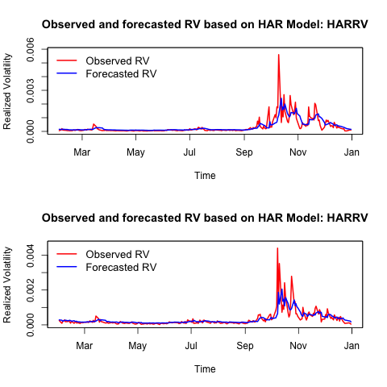
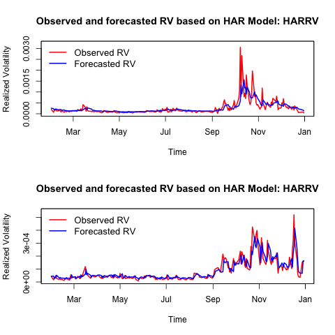

[](http://quantlet.de/index.php?p=info)

## [](http://quantlet.de/) **SFErealizedVolatilityVarious** [](http://quantlet.de/d3/ia)

```yaml

Name of QuantLet : SFErealizedVolatilityVarious

Published in : Statistics of Financial Markets I

Description : 'Realized volatility analysis using harModel of Dow Jones, CAC 50, FTSE 100 and
Euro-USD exchange market'

Keywords : Volatility, graphical representation, time-series, log returns, variance

Author : Luis Alejandro Sarmiento Abogado

Submitted : Tue, December 28 2015 by Luis Alejandro Sarmiento Abogado

```







### R Code:
```r
# Clear enviorenment
graphics.off()
rm(list = ls())

# Load packages
library(highfrequency)

# Load data from R enviorenment
data(realized_library)

# Select Dow Jones, CAC 40, FTSE 100 and USD-Euro returns Realized
# Variance vectors
DJI_RV  = realized_library$Dow.Jones.Industrials.Realized.Variance
CAC_RV  = realized_library$CAC.40.Realized.Variance
FTSE_RV = realized_library$FTSE.100.Realized.Variance
UE_RV   = realized_library$USD.Euro.Realized.Variance

# Remove NA's
DJI_RV  = DJI_RV[!is.na(DJI_RV)]
CAC_RV  = CAC_RV[!is.na(CAC_RV)]
FTSE_RV = FTSE_RV[!is.na(FTSE_RV)]
UE_RV   = UE_RV[!is.na(UE_RV)]

# Select Year 2008
DJI_RV  = DJI_RV["2008"]
CAC_RV  = CAC_RV["2008"]
FTSE_RV = FTSE_RV["2008"]
UE_RV   = UE_RV["2008"]
head(DJI_RV)
class(DJI_RV)
# Apply the har Model for observed and forecasted realized variance in
# a HAR model

DJ   = harModel(data = DJI_RV, periods = c(1, 5, 22), RVest = c("rCov"), 
              type = "HARRV", h = 1, transform = NULL)

CAC  = harModel(data = CAC_RV, periods = c(1, 5, 22), RVest = c("rCov"), 
               type = "HARRV", h = 1, transform = NULL)

FTSE = harModel(data = FTSE_RV, periods = c(1, 5, 22), RVest = c("rCov"), 
                type = "HARRV", h = 1, transform = NULL)

UE   = harModel(data = UE_RV, periods = c(1, 5, 22), RVest = c("rCov"), type = "HARRV", 
              h = 1, transform = NULL)

# results summary
summary(DJ)
summary(CAC)
summary(FTSE)
summary(UE)

# PLOTS
png(file = "DJ1.png")
par(mfrow = c(2, 1))

plot(DJ)
plot(CAC)

dev.off()

png(file = "DJ2.png")
par(mfrow = c(2, 1))

plot(FTSE)
plot(UE)

dev.off()


```
