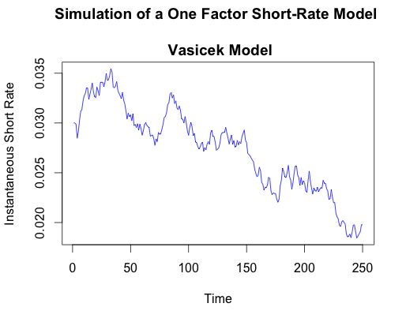

[](http://quantlet.de/index.php?p=info)

## [](http://quantlet.de/) **SFEsimShortRate** [](http://quantlet.de/d3/ia)

```yaml

Name of Quantlet : SFEsimShortRate

Published in : Statistics of Financial Markets I

Description : 'Simulates and plots various One-Factor Short-Rate Models that describe the process
of the instantaneous short term interest rate.'

Used Models : Vasicek, Cox-Ingersoll-Ross, Hull-White, Ho-Lee

Keywords : 'simulation, interest-rate, short-rate, wiener-process, vasicek, integration,
time-series, stochastic-process'

See also : SFEsimOU, SFEsimCIR, SFEsimGBM, SFEWienerProcess, SFEustb

Author : Anastasia Gkelameri, Nils Hinrichs

Submitted : 2015/12/14

Input: 
- T: Time Period
- dt: length of each time interval
- a: reversion rate
- b: long term level
- sigma: volatility
- delta: deterministic function of time
- r[1]: initial short-rate value

Output : Plots of the Instantaneous Short Rate simulated by different Short Rate Models

```




```r
rm(list = ls(all = TRUE))
graphics.off()

                                       # some general parameters
set.seed(1)                            # seed for random number generation
dt   = 1                               # length of each time interval
T    = 250                             # time period
t    = seq(1,T,by=dt)                  # vector containing time steps
r    = NULL                            # vector of instantaneous short rate
r[1] = 0.03                            # initial value of the short rate
dv   = NULL                            # random increment, depending on
                                       # the Wiener Process and volatility


SFEsimVasicek=function(a,b,sigma){     # Vasicek Short Rate Model
  for (i in 2 : T){
    dv[i] = sigma * sqrt(dt/T) * rnorm(1,mean=0,sd=1)
    r[i]  = r[i - 1] + a * (b - r[i - 1]) * (dt/T) + dv[i] 
  }
  plot(t,r,type="l",col="blue",xlab="Time",ylab="Instantaneous Short Rate", 
       main="Simulation of a One Factor Short-Rate Model 
       \n Vasicek Model")
}


SFEsimCIR=function(a,b,sigma){         # Cox-Ingersoll-Ross Short Rate Model
  for (i in 2 : T){
    dv[i] = sigma * sqrt(dt/T) * sqrt(r[i - 1]) * rnorm(1,mean=0,sd=1)
    r[i]  = r[i - 1] + a * (b - r[i - 1]) * (dt/T) + dv[i] 
  }
  plot(t,r,type="l",col="blue",xlab="Time",ylab="Instantaneous Short Rate", 
       main="Simulation of a One Factor Short-Rate Model 
       \n Cox-Ingersoll-Ross Model")
}


delta=function(t){                     # Deterministic function of Time
  delta = 0.0000644 * t
  return(delta)
}


SFEsimHullWhite=function(a,sigma){     # Hull-White Short Rate Model
  for (i in 2:T){
    dv[i] = sigma * sqrt(dt/T) * rnorm(1,mean=0,sd=1)
    r[i]  = r[i - 1] + (delta(t = i - 1) - a * r[i - 1]) * (dt/T) + dv[i]
  }
  plot(t,r,type="l",col="blue",xlab="Time",ylab="Instantaneous Short Rate", 
       main="Simulation of a One Factor Short-Rate Model 
       \n Hull White Model")
}


SFEsimHoLee=function(sigma){           # Ho-Lee Short Rate Model
  for (i in 2:T) {
    dv[i] = sigma * sqrt(dt/T) * rnorm(1,mean=0,sd=1)
    r[i]  = r[i - 1] + delta(i - 1) * (dt/T) + dv[i]
  }
  plot(t,r,type="l",col="blue",xlab="Time",ylab="Instantaneous Short Rate", 
       main="Simulation of a One Factor Short-Rate Model 
       \n Ho Lee Model")
}


 SFEsimVasicek(a = 0.161, b = 0.014, sigma = 0.009)

 SFEsimCIR(a = 0.221, b = 0.02, sigma = 0.055)

 SFEsimHullWhite(a = 0.161, sigma = 0.009)
 
 SFEsimHoLee(sigma = 0.009)

```
